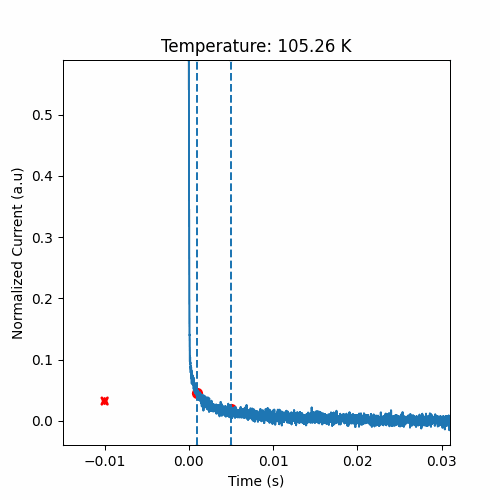
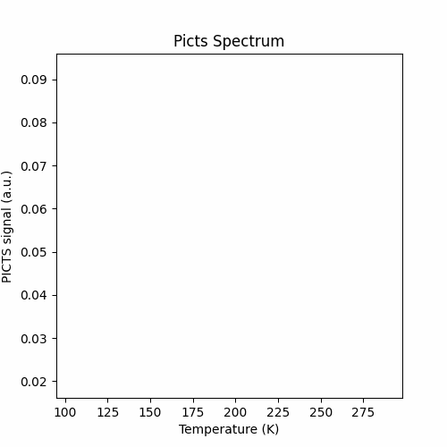
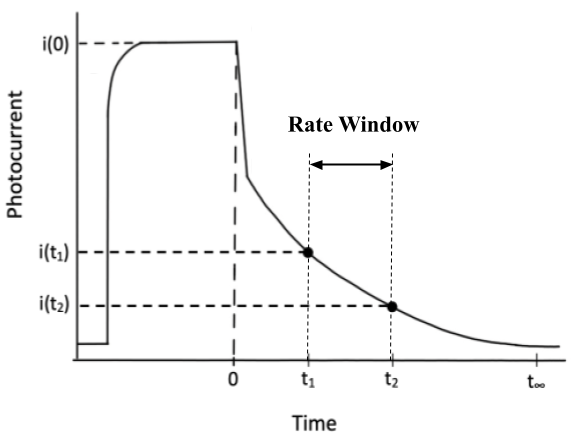

# Software & Computing project: picts_gif

## What is picts_gif project? 
Picts_gif is a tool that allows you to create animated graph and saved it as gif. It is a project born for my need to create animated data to be projected during the discussion of the thesis, but it was written in a modular way, so as to be easily modifiable and adaptable to every need. What you need is data that can be transformed into pandas Dataframes. I accompany my data with dictionaries, in json format, where some parameters are saved that allow me to manipulate the raw input data.  In my specific case, the raw data used were collected from Photo-Induced Current Transient Spectroscopy (PICTS) measurements, a spectroscopic technique used in the study of defects in semiconductor crystal lattice. The raw data are nothing more than measurements of photo-induced current transients as a function of temperature.

## Installation
### Prerequisites
You’ll need to know a bit of [Python](https://docs.python.org/3/tutorial/). The code of this project was written in Python 3.9.1.. The main libraries used in this project are Matplotlib, Pandas, Numpy and Scipy. You must have Anaconda or Miniconda installed on your sytem. Make sure you have a python version 3.9+, otherwise you may have trouble installing the environment.

### On Linux
[Clone](https://docs.github.com/en/get-started/getting-started-with-git/about-remote-repositories) the repository on your machine. To do this, follow these simple instructions.
I assume you have a Linux distribution installed. Choose a directory to clone the repository to. Now, clone the repository on your machine
```
git clone https://github.com/vitofod/picts_gif.git
```
Then create anaconda virtual environment 
```
conda env create --file environment.yml
```
Install the library 'picts_gif' with 
```
pip install <your_path>
```
### Other OS
I don't use Windows or Mac, so I'm sorry but I can't help you more than that. Install any [Linux](https://help.ubuntu.com/community/DualBoot) distribution, then go back to the previous paragraph.


## Usage
Data analysis of PICTS spectra is a long and complex job and is not the goal of this project. The data that will be used are raw data as they were acquired, but will be accompanied by a json file in which all the fundamental parameters to reconstruct the output signal are saved. Before continuing with the reading, it is strongly recommended to take a few minutes to read the 'EXTRA' paragraph where the PICTS measurement technique is broadly explained.
The software works via a Command Line Interface (CLI).
To get started, be sure that the python virtual environment is activated. 
To be able to run, the software must know the location of the data file and its dictionary, and some options on the type of display and on saving the gif. In particular:
* --path (or -p): the complete path to the tdms file (file name must be included);
* --dict (or -d): the complete path to the json file (file name must be included); 
* --plot (or -pl): this command is used to specify which graph we want to see the animation of. The options are `transient` (we will see the current transient animation), `spectrum` (we will see the PICTS spectrum animation) and `all` (we will see both animations);
* --interval (or -i): through this option you can adjust the speed of the animation. The input is a float and expresses the temporal distance, in milliseconds, between one frame and the next. By default it is 1 millisecond;
* --output (or -o): the complete path to the output directory (file name must be included) where the gif will be stored. If you do not enter an output directory, the animation will not be saved;
* --show: the animation will be displayed if and only if specifically requested;
* --no-show: the animation will not be displayed on the screen;
Of these commands, --path, --dict and --plot are mandatory, while the others are optional. 

If at any time you need to review the instructions on using the CLI, help has been added.
Call the following script (from anywhere).
```
picts_gif_start --help
```
The output is shown below.
```
usage: picts_gif_start [-h] -p PATH -d DICT [-pl {transient,spectrum,all}] [-i INTERVAL] [-o OUTPUT_DIR] [--show] [--no-show] 

optional arguments:
  -h, --help            show this help message and exit
  -p PATH, --path PATH  The path to the tdms file. E.g.: --path /home/user/desktop/data.tdms
  -d DICT, --dict DICT  The path to the dictionary json file. E.g.: --dict /home/user/desktop/dict.json
  -pl {transient,spectrum,all}, --plot {transient,spectrum,all}
                        Specify what to animate. E.g.: --plot transient -> for the transient plot. E.g.: --plot spectrum -> for the spectrtum plot. E.g. : --plot all -> for plot
                        both
  -i INTERVAL, --interval INTERVAL
                        The interval defines the speed of the animation. It is the time, expressed in milliseconds, between one frame and another. Animations already have a
                        default value of 1 ms E.g.: --interval 1 -> you have set the interval between one frame and another to one millisecond
  -o OUTPUT_DIR, --output-dir OUTPUT_DIR
                        The output directory where the gif is stored. If you do not enter an output directory, the animation will not be saved
  --show                To show the animation, digit: --show
  --no-show             If you don't want to see the animation digit: --no-show
```
To recap in simple words:
for the program to start, you must first define the location of the input files. Next, you have to choose what you want to be plotted, for example the transient, 
the spectrum or both. If you want, you can define the animation execution speed through the 'interval' parameter. If you want to save the animation, you must expressly define the position in which you want to save it, otherwise the file will not be saved. You can also decide whether to display the animation or not. Path directory for tdms and json file are mandatory. If you don't enter them, you will get an error back. If you don't specify what kind of animation you want to create (transient or spectrum) both will be displayed by default. The files will be saved if and only if a path is entered to save the data. Likewise, if you are not specifically asked to display animations with the '--show' parameter, they will not be displayed by default.

We need to open a parenthesis. The files in this repository are very large, several tens of megabytes. My computer is old and has a hard time handling such large files, so when I try to create the animation of both the transient and the spectrum, or worse when I try to both view them and save them at the same time, I can't adjust the running speed (interval) that much and the gif shows lags. This is the main limitation to the output files that are generated. With smaller files or newer computers, this problem does not arise. In the same way it is possible to overcome this problem by subsequently making a video rendering of the gif obtained.

Likewise, the saved gifs turn out to be very large. It is advisable, if you wanted to save the gif with both animations, to modify, in the json file that accompanies the data, the n_windos parameter, putting it at 2 or 3 maximum. It is also advisable to reduce the fps parameter found in the classes that create the animations, in the method that allows you to save the gif. The saving process can take up to a few minutes.

## Tutorial
### How to show the animation of the current transient 
In this tutorial we will see how to start the animation of the current transient in PICTS experiment. 
We will use the 'data.tdms' and 'dictionary.json' files located in /wherever_you_have_saved_the_repository/picts_gif/tests/test_data.
We just want the animation to appear on screen, we don't want to save it.
Open a shell, go to the directory that contains the project's source code, activate the python virtual environment and execute:
```
$ picts_gif_start --path tests/test_data/data.tdms --dict tests/test_data/dictionary.json --plot transient --show
```
This is what you should see




### How to show PICTS spectrum animation
In this tutorial we will see how to start the animation of the picts spectrum. 
We will use the 'data.tdms' and 'dictionary.json' files located in the wherever_you_have_saved_the_repository/picts_gif/tests/test_data.
We just want the animation to appear on screen, we don't want to save it.
Open a shell, go to the directory that contains the project's source code, activate the python virtual environment and execute:
```
$ picts_gif_start --path tests/test_data/data.tdms --dict tests/test_data/dictionary.json --plot spectrum --show
```
This is what you should see



### How to show PICTS spectrum and transient animation
In this tutorial we will see how to start the animation of the picts spectrum and transient at the same time. 
We will use the 'data.tdms' and 'dictionary.json' files located in the wherever_you_have_saved_the_repository/picts_gif/tests/test_data.
We just want the animation to appear on screen, we don't want to save it.
Open a shell, go to the directory that contains the project's source code, activate the python virtual environment and execute:
```
$ picts_gif_start --path tests/test_data/data.tdms --dict tests/test_data/dictionary.json --plot all --show
```
What do you see? It's a little slow, isn't it? I am very sorry for that.

### How to save the gif of a PICTS spectrum
In this tutorial we will see how to save, without showing, the animation of the picts spectrum. 
We will use the 'data.tdms' and 'dictionary.json' files located in the wherever_you_have_saved_the_repository/picts_gif/tests/test_data.
We just want to save the animation, we don't want it to appear on screen.
Open a shell, go to the directory that contains the project's source code, activate the python virtual environment and execute:
```
$ picts_gif_start --path tests/test_data/data.tdms --dict tests/test_data/dictionary.json --plot spectrum -o ./output/ --no-show
```
Now go look in the directory you chose as output if you find anything.

## Structure of the code
You now have everything you need on your computer. The code can be described by the following structure:
```
          ______utilities.py
         |
input_handler.py
         |
         |__picts_spectrum_plot.py____
         |                            |
         |__----                      |
         |__----                      |__main.py
         |__----                      |
         |                            |
         |__picts_transient_plot.py___|

```
input_handler.py manages the input files. In my case the input files are [tdms](https://www.ni.com/it-it/support/documentation/supplemental/06/the-ni-tdms-file-format.html), an extension used by LabVIEW language. The purpose of the InputHandler class in input_handler.py is to open raw data from a certain format, preprocess them and return a dataframe (or more than one) of it. To increase code readability and versatility, the utilities.py library has been created, which contains a set of methods that perform specific tasks. At this point, animations can be created from the dataframe(s). Each animation is seen as a class of its own. In this repository you can find two plotting class that i have created, picts_spettrum_plot.py and pict_transient_plot.py, but the idea is that you can create complex animations as you like by joining as many of these classes as you want, following the structure of the class I created. 

The picts_spettrum_plot.py file manages the animation of the PICTS spectra graphs, while picts_transient_plot.py manages the animations of the current transients as a function of temperature. If you're wondering what I'm talking about, take a look further down to the 'EXTRA' section. The main.py file is actually the "executable" of our code and it is installed as an executable script called "picts_gif_start" during the installation procedure. Through a Command Line Interface it is able to manage inputs and outputs, providing a certain variety of options. You can create single animations, create multiple animations at the same time, save the created animations. Animations are saved as gifs.

Following the installation of the project, as explained in the previous paragraph, you will find a directory on your disk called 'picts_gif'. The structure of the various sub-folders is as follows (I omit the directories created automatically and those ignored):

```
picts_gif_______pict_gif__(here you can find the code)
              |
              |_data_(raw data in tdms or pkl format)
              |
              |_tests_____(tests code)
                        |
                        |_test_data__(data for tests and tutorial)
```

In 'picts_gif' you will find the codes described above, while in 'tests' you will find, in addition to the test_data directory, the codes for testing. In 'test_data' you will find the input data used as "test data" files accompanied by the dictionaries. In data you will find other tdms data with their dictionaries.

## Testing
All tests were performed with the `pytest` and `coverage` libraries . The testing files all start with the name `test_*` and are located in directory `tests`.
To start tests, you have to change directory to
```
wherever_you_have_saved_the_repository/picts_gif/tests
```
You can test all the code with:
```
pytest tests -v
```
If you want to start individual test_*.py files, use the command 
```
pytest tests -v <test_filename.py>
```
If you want to start specific part of tests, grouped by name, you can use the command
```
pytest -v -k "test_name_of_the_test"
```
Or you can go to the next level by run the script start_test.sh:
```
./start_test.sh
```
If the script doesn't work, try
```
chmod +x start_test.sh
./start_test.sh
```
Now, in the test folder, you will see a new directory called `cov_report_html`. Double click. To understand what you are looking at, 
refer to the documentation for [coverage](https://coverage.readthedocs.io/en/6.4.4/) python library. 


## Extra
### What a PICTS experiment is: a short description to better understand the code
Photo-induced transient current spectroscopy (PICTS) is a technique for investigating deep levels (crystalline defects that act as recombination centers for charge carriers) and is part of the larger family of transient spectroscopy techniques. Deep levels are commonly called 'traps'. Radiation detectors work by converting the radiation incident on a sensitive crystal into electron-hole pairs. In the presence of a potential difference at the ends of the crystal, the pairs separate and move towards the electrodes. In the presence of deep levels, however, the charge carriers are trapped and converted in a non-radiative manner, making sure that the signal present at the ends of the device is only a fraction of that generated. Knowing the mechanisms underlying these recombination phenomena, allows to increase the efficiency of the devices. 

The idea of ​​the PICTS technique is to fill these traps with charge carriers through a photo-induced current. By stopping the external excitation, the photoinduced current will drop sharply to dark levels. At this point, the traps begin to empty with a trend that can be described by the Maxwell-Boltzmann statistics. There is therefore a thermal emission of charge carriers at a certain rate. This rate can be described as [see 'The Electrical Characterization of Semiconductors: Majority Carriers and Electron States', P. Blood, J. W. Orton, Academic Pr, 1992, cap. 7] 

$e_{i}(T) = \gamma T^2 \sigma_{ia} exp\left (- \frac{E_{ia}}{K_bT}\right )$

where i = n for electrons and i = p for holes, $σ_{ia}$ = (g0/g1)σ∞ is the so called electron/hole apparent capture cross section, with g0 and g1 respectively empty trap energy degeneracy and occupied trap energy degeneracy; T is the temperature, $E_{ia} is the apparent trap activation energy, γ is a constant. 
At the same time it is possible to describe the current transient as [see Tapiero et al., Journal of Applied Physics 64, 4006 (1988)]

$I(t) = \alpha qV \mu \tau n_t(0) e_i e^{-e_it}$

where q is the elementary charge, V the applied voltage, $n_t(0)$ the initial trap carrier density, t the time, $e_i$ the thermal emission rate and μτ the so called mobility-lifetime. $\alpha$ is a geometrical parameter due to the shape of the elettrical contacts.
The PICTS spectrum involves the concept of "rate window".  The rate windows is an arbitrarily chosen time interval from where we go to measure the difference in the current value. Referring to Figure, the istant t = 0 coincide with the LED (the external photo excitation) turned off.



Once the time instant in which the transition to thermal emission occurs has been defined in the electrical transient (we can call this instant t0), we choose two successive instants t1 > t0 and t2 > t1 and express the PICTS signal as the difference in the value of the currents in these two instants:

$S(T; t_1, t_2) = i(t_1) - i(t_2)$

If there was no thermal emission from the traps, the current difference between the two fixed points would simply be a constant as the decay of the transient would not be perturbed by the emptying of the traps. If a trap is present, however, we expect the thermal emission to reach a maximum at a certain temperature $T_m$, and therefore also the difference in the PICTS signal will be characterized by a maximum exactly at the point where the thermal emission from part of the trap is maximum. Mathematically, we can write the maximum of $S(T ; t1, t2)$ as

$\dfrac{dS}{dT} = \dfrac{dS}{de_n}\dfrac{de_n}{dT} = 0$

and by considering the equations above, the solution brings to

$e_n (t_1 -t_2) = \ln{\dfrac{1 - e_nt_2}{1 - e_nt_1}}$

This is a transcendental equation and must be solved numerically. Ideally, considering a semiconductor in which there is only one trap state, and chosen two time instants t1 and t2, we obtain a function S(T ; t1, t2) which will show a peak at a certain temperature $T_m$. By imposing the derivative of S(T ; t1, t2) to zero, we obtain the transcendental equation that tells us what is the value of the thermal emission rate $e_i$ we are scanning given t1 and t2. By changing values of t1 and t2, that is, by changing rate window, we obtain a curve S′(T ; t1′, t2′) identical to the previous one but shifted, since now the value of $e_n$ and $T_m$ differ from the previous one. Therefore, by choosing a collection of values t1 and t2 it is possible to obtain a collection of values $e_i$ as a function of $T_m$, and by plotting that in an Arrhenius form we have

$\ln{\left({T_m}^2/e_n(T_m)\right)} = \gamma \sigma + \dfrac{E_a}{K_bT_m}$

from which we can extract the values ​​of the activation energy and the capture cross section of the trap(s). 
In a data analysis it is important to correctly identify the instant $t_0$ in which the thermal emission by the traps begins. In addition, to make sure that the shape of the spectrum signal depends only on the chosen values $t_1$ and $t_2$, the signal must be normalized. 

A PICTS experiment can be summarized with the following two steps: charge carriers are produced through an optical excitation and fill the traps; the optical excitation is switched off and the transient of the electric current is measured, which carries with it information about the thermal emission from the traps. These two steps are repeated during a temperature scan. The raw acquired signal is therefore a collection of current transients as a function of temperature. 
At this point, pairs of time instants (t1, t2) are selected, which take the name of rate window. For each of these pairs the PICTS spectrum will be generated, which consists in a collection of curves $S(T; t1, t2)$, a graph for each rate window value. These curves are essentially identical, but shifted from each other on both axes. Each of these curves shows a maximum for each trap present in the crystal. By processing the data it is possible to extract all the maximum points (en, Tm), one point for each curve. By plotting these points and fitting them into an Arrhenius plot, important physical information is extracted. 

It is not an intuitive experimental technique, and it can take time to fully understand it. Anyway, I really hope I was clear enough to help you better understand the code I wrote.

